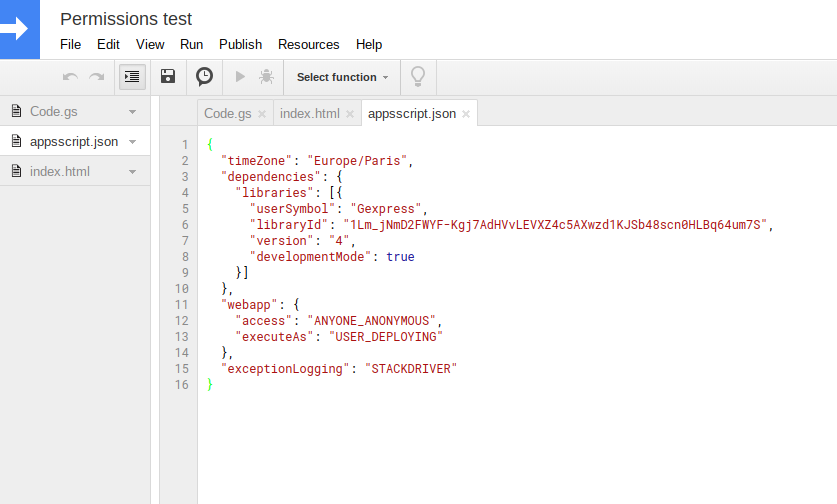

This appscript library keeps application 'kinda' nodejs-portable

## Usage

```
var app = new Gexpress.App()

app.use(function(req,res,next){
  req.user = Session.getActiveUser().getEmail()
  next()
})

app.get('/ping',function(req,res,next){
  Logger.log(req)
  res.set('content-type','application/json')
  res.send( req )
  res.end()
})

app.get('/js',function(req,res,next){
  res.set('content-type','application/javascript')
  res.send( 'console.log("hello world")' )
  res.end()
})

app.get( /.*/, function(req,res,next){ // default to homepage
  Logger.log("defaulting to homepage")
  var html = HtmlService.createTemplateFromFile('index') // this will get the index.html-file from your appscript project
  html.title = 'Hello'
  res.set('content-type','text/html')
  res.send( html.evaluate().setXFrameOptionsMode(HtmlService.XFrameOptionsMode.ALLOWALL).getContent() )
  res.end()
})

function doGet(e) {
  return app.doGet(e)
}

function doPost(e){
  return app.doPost(e)
}

```

> NOTE: appscript does not allow async responses, therefore next() can only be used to stop further middleware-execution

## How to include library

Add '1Lm_jNmD2FWYF-Kgj7AdHVvLEVXZ4c5AXwzd1KJSb48scn0HLBq64um7S' to your libraries (Resources > Libraries), or edit your manifest file (`View > Show manifest file`) like so:



## RESTFUL-ish

Webtraffic to Google Appscript Webapps are limited in many ways. 
Why? Because hackers.
This forces Gexpress to expose endpoints in a slightly different, but still convenient way:

| Gexpress method | Listens to webrequest(s) | Anonymous webrequest | application/json | application/javascript | text/xml | text/plain | text/html 
|-|-|-|-|-|-|-|-|
| app.get('/foo',..)     | GET  /exec?path=/foo                | ✓              | ✓ | ✓ | ✓ | ✓ | ⚠ |
|                        | POST /exec?path=/foo&method=GET     | ✓              | ✓ | ✓ | ✓ | ✓ | ⚠ |
|                        | GET  /exec/foo                      | triggers login | ✓ | ✓ | ✓ | ✓ | ⚠ |
| app.post('/foo',..)    | POST /exec?path=/foo                | ✓              | ✓ | ✓ | ✓ | ✓ | ⚠ |
|                        | POST /exec/foo                      | triggers login | ✓ | ✓ | ✓ | ✓ | ⚠ |
| app.put('/foo',..)     | POST /exec?path=/foo&method=PUT     | ✓              | ✓ | ✓ | ✓ | ✓ | ⚠ |
|                        | POST /exec/foo?method=PUT           | triggers login | ✓ | ✓ | ✓ | ✓ | ⚠ |
| app.delete('/foo',..)  | POST /exec?path=/foo&method=DELETE  | ✓              | ✓ | ✓ | ✓ | ✓ | ⚠ |
|                        | POST /exec/foo?method=DELETE        | triggers login | ✓ | ✓ | ✓ | ✓ | ⚠ |
| app.options('/foo',..) | POST /exec?path=/foo&method=OPTIONS | ✓              | ✓ | ✓ | ✓ | ✓ | ⚠ |
|                        | POST /exec/foo?method=OPTIONS       | triggers login | ✓ | ✓ | ✓ | ✓ | ⚠ |

> ⚠ = will trigger `this application was created by another user`-banner if not logged in as appscript-owner/collaborator
