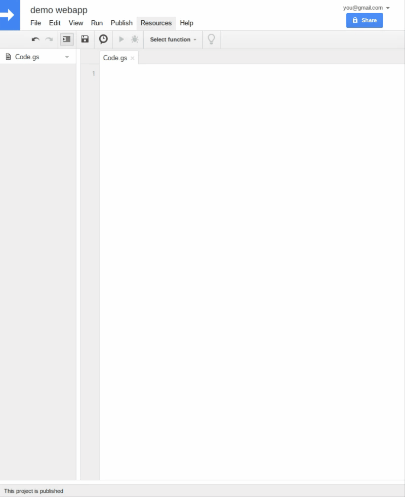

## Usage

Surf to [script.google.com](https://script.google.com), create a script, and copy/paste this:

```
var app   = new Gexpress.App()
var cache = CacheService.getScriptCache()

cache.put("/hello", JSON.stringify({date: new Date()}) )

app.use(function(req,res,next){
  req.user = Session.getActiveUser().getEmail()
  next()
})

app.get('/hello',function(req,res,next){
  res.set('content-type','application/json')
  res.send( cache.get('/hello') )
  res.end()
})

app.get('/client.js', app.client() )

// this hooks Gexpress into appscript 
function doGet(e) { return app.doGet(e)  }
function doPost(e){ return app.doPost(e) }
```
> .put() .post() .delete() and .options() are also supported (see virtual endpoints)

* /hello [live output](https://script.google.com/macros/s/AKfycbziqV-T6HudofXLfmMoQS4_AL68f_x6CUlJYIzs2Q-SYaHoWBgq/exec?path=/hello)
* /client.js [live output](https://script.google.com/macros/s/AKfycbziqV-T6HudofXLfmMoQS4_AL68f_x6CUlJYIzs2Q-SYaHoWBgq/exec?path=/client.js)

## Include the library

Add `1Lm_jNmD2FWYF-Kgj7AdHVvLEVXZ4c5AXwzd1KJSb48scn0HLBq64um7S` to your libraries (Resources > Libraries).



> NOTE: please make sure you select the latest version of the library

## Permissions and users

Make sure you deploy with these settings:


You can add google users to the appscript (share-button), **re-deploy**, and you're done.
Rules of thumb:

* use the rooturl (`/exec`) for anonymous access
* use other urls (`/exec/myadmin` e.g.) urls for authenticated access

The latter will automatically trigger login for anonymous users.
See an overview of (non)authenticated urls below.

## RESTFUL-ish

Webtraffic to Google Appscript Webapps is limited/secured in many ways.
This is not that bad, given that every appscript gives us:

* free security + free https! =)

This however, forces Gexpress to expose endpoints in a slightly different way (compared to express):

#### Authenticated endpoints 

| Gexpress method | Listens to webrequest(s) | Anonymous webrequest | CORS | application/json | application/javascript | text/xml | text/plain | text/html 
|-|-|-|-|-|-|-|-|-|
| app.get(/.*/,..)       | GET  /exec                            | ✓              | ✓ | ✓ | ✓ | ✓ | ✓ | ⚠ |
| app.get('/foo',..)     | GET  /exec/foo                        | triggers auth  |   | ✓ | ✓ | ✓ | ✓ | ⚠ |
| app.post('/foo',..)    | POST /exec/foo                        | triggers auth  |   | ✓ | ✓ | ✓ | ✓ | ⚠ |
| app.put('/foo',..)     | POST /exec/foo&method=PUT             | triggers auth  |   | ✓ | ✓ | ✓ | ✓ | ⚠ |
| app.delete('/foo',..)  | POST /exec/foo&method=DELETE          | triggers auth  |   | ✓ | ✓ | ✓ | ✓ | ⚠ |
| app.options('/foo',..) | POST /exec/foo&method=OPTIONS         | triggers auth  |   | ✓ | ✓ | ✓ | ✓ | ⚠ |

#### Virtual CORS anonymous endpoints 

Usually, you want this when doing browserrequests to Gexpress. 

| Gexpress method | Listens to webrequest(s) | Anonymous webrequest | CORS | application/json | application/javascript | text/xml | text/plain | text/html 
|-|-|-|-|-|-|-|-|-|
| app.get('/foo',..)     | GET  /exec?path=/foo                 | ✓              | ✓ | ✓ | ✓ | ✓ | ✓ | ⚠ |
|                        | POST /exec?path=/foo&method=GET      | ✓              | ✓ | ✓ | ✓ | ✓ | ✓ | ⚠ |
| app.post('/foo',..)    | POST /exec?path=/foo&method=POSTt     | ✓              | ✓ | ✓ | ✓ | ✓ | ✓ | ⚠ |
| app.put('/foo',..)     | POST /exec?path=/foo&method=PUT      | ✓              | ✓ | ✓ | ✓ | ✓ | ✓ | ⚠ |
| app.delete('/foo',..)  | POST /exec?path=/foo&method=DELETE   | ✓              | ✓ | ✓ | ✓ | ✓ | ✓ | ⚠ |
| app.options('/foo',..) | POST /exec?path=/foo&method=OPTIONS  | ✓              | ✓ | ✓ | ✓ | ✓ | ✓ | ⚠ |

> ⚠ = will trigger `this application was created by another user`-banner if not logged in as appscript-owner

> NOTE: disable the virtual endpoints by initializing Gexpress with `new Gexpress.App({pathToQuery:false})`

## Regex / Serving files / templating

Appscript has builtin support for templating.
Serve this `index.html`-file:

```
<!DOCTYPE html>
<html>
  <head>
    <base target="_top">
	<title><?= title ?></title>
  </head>
  <body>
    <?!= foo() ?>
  </body>
</html>

```

With this endpoint:


```
function foo(){
  return "Hello world"
}

app.get( /.*/, function(req,res,next){ // default to homepage
  Logger.log("defaulting to homepage")
  var html = HtmlService.createTemplateFromFile('index') // this will get the index.html-file from your appscript project
  html.title = 'Hello'
  res.set('content-type','text/html')
  res.send( html.evaluate().setXFrameOptionsMode(HtmlService.XFrameOptionsMode.ALLOWALL).getContent() )
  res.end()
})

```

## Doing requests from the Browser

Gexpress can automatically generate a browser client, which you can decorate further:

```
app.put('/foo', function(req,res,next){   .... })

app.get('/client.js', app.client( function(code){
  return '// foo \n' + code + '\n// bar'
})

```
> Now insert `<script src="https://script.google.com/{SCRIPTID}/exec?path=/client.js"></script>` in your html`

The generated client will allow you to do this:

```
  backend.put('/foo').then( alert ).catch( alert) 
```

Just look at the client-source and you will know how to use it.
